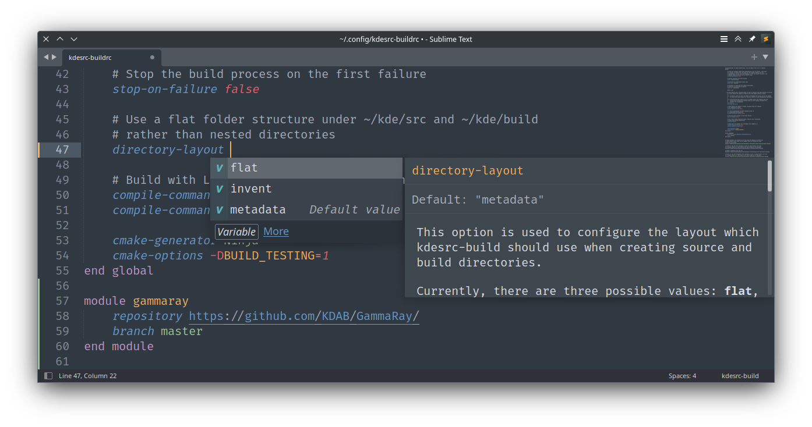
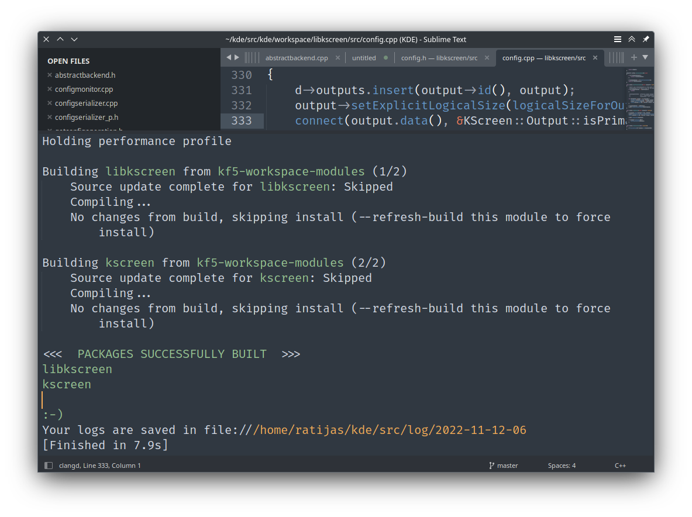

# kdesrc-build for Sublime Text

[](https://github.com/ratijas/kdesrc-build-sublime/actions/workflows/syntax.yml)


## About

[KDE/Plasma](https://kde.org/) development team relies on [kdesrc-build](https://invent.kde.org/sdk/kdesrc-build) tool to manage their development setup: fetch and update source code, set up environment variables, resolve dependencies, compile and install projects.

This package brings support for kdesrc-build into [Sublime Text](https://www.sublimetext.com/) editor:

- intelligent **syntax highlighting** with snippets and plugins makes it easy to edit and navigate between kdesrc-buildrc configuration files.
- Context-aware **auto-completion** suggests option names, and their values, be it boolean flags, predefined set of strings, dynamic list of choices or file system paths.
- LSP-style **documentation**[^1] for each option: just hover the option name, or click "More" in the completions popup.
    
- Syntax for output panel of **build commands** / build results: while this package does not[^2] provide any \*.sublime-build build system definitions, you may easily add your own (with exact kdesrc-build invocation command that fits your needs), and get nice colorful output like in real terminal:
    ```json
    {
        "cmd": ["kdesrc-build", "--no-include-dependencies", "--no-src", "kirigami"],
        "syntax": "scope:source.build_output.kdesrc-build",
    }
    ```

    

## Installation

The easiest way to install this plugin, is to use the [Package Control](https://packagecontrol.io/) plugin.

 - Open up the command palette: Ctrl+Shift+P (Linux, Windows) / Cmd+Shift+P (OS X)
 - Search for Package Control: Install Package
 - Search for kdesrc-build
 - Hit Enter

### Using Git

Go to your Sublime Text Packages directory and clone the repository using the command below:

    $ git clone https://github.com/ratijas/kdesrc-build-sublime

### Manual Download

 - Download the files using the .zip download option
 - Unzip the files (and rename the folder to QML if needed)
 - Copy the folder to your Sublime Text Packages directory

## License

This package is licensed under the MIT License.

[^1]: Documentation's content is extracted from kdesrc-build documentation. It is provided with the package. Maintainers should use [gen_conf_options.py](./plugins/gen_conf_options.py) script to update documentation database whenever it gets updated upstream.
[^2]: It is planned, however, to implement a build system that detects which package current buffer belongs to, and rebuild only that package. Someday…
